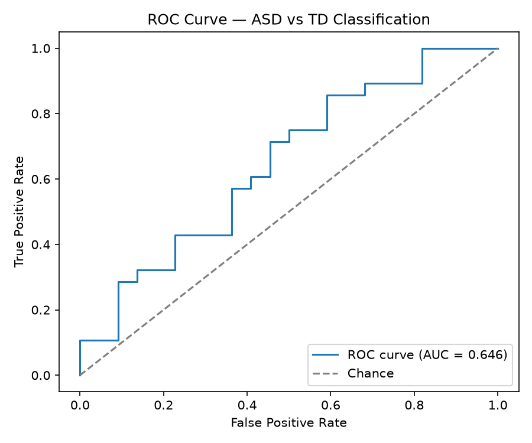
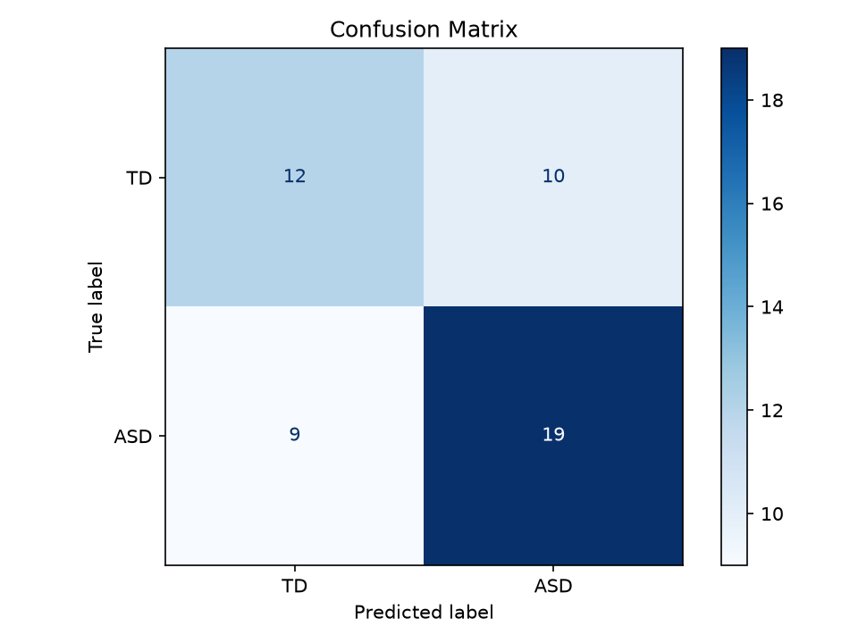
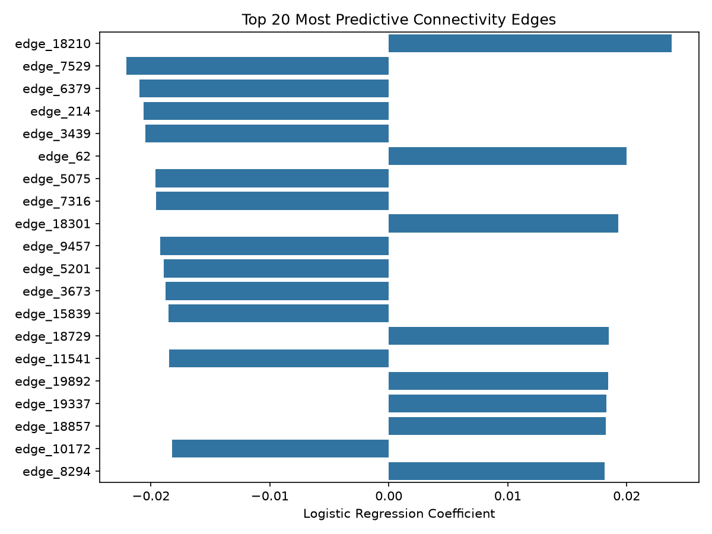

# Autism Risk Prediction from Resting-State fMRI (ABIDE)

Can a machine-learning model trained on multi-site neuroimaging data generalize to an entirely unseen acquisition site?

This project classifies ASD vs. typically developing (TD) participants using resting-state fMRI functional connectivity from the public ABIDE dataset. Rather than reporting standard cross-validation performance alone, models are evaluated with **leave-one-site-out (LOSO) cross-validation** to measure the site-generalization gap — a challenge central to real-world multi-site biomedical data, but one that's often glossed over in public ABIDE analyses.

**Key result:** logistic regression achieved 0.747 AUC under standard cross-validation vs. 0.656 AUC under LOSO — a 0.092 AUC generalization gap.

## Motivation

Most public analyses of the ABIDE dataset report accuracy or AUC under standard cross-validation, which can look impressive but masks a real problem: models trained on multi-site neuroimaging data often fail to generalize to unseen sites due to scanner and protocol differences (batch effects). This project measures that generalization gap directly and treats its size as a key result in its own right, not just a caveat.

## Dataset

- **Source:** [ABIDE](http://fcon_1000.projects.nitrc.org/indi/abide/) (Autism Brain Imaging Data Exchange), a public, multi-site resting-state fMRI dataset
- **Sample:** 200 subjects (111 ASD / 89 typically developing), ages 8–35, pooled across 6 acquisition sites
- **Features:** pairwise functional connectivity across 200 regions from the CC200 atlas (~19,900 features per subject)

## Methodology

1. **Data pipeline** — fetched and preprocessed ABIDE data using `nilearn`, extracted CC200-atlas-based pairwise correlation matrices as features
2. **Modeling** — trained and compared three classical ML models: logistic regression, SVM (RBF kernel), and gradient boosting
3. **Validation** — evaluated each model under two schemes:
   - Standard stratified k-fold cross-validation
   - Leave-one-site-out (LOSO) cross-validation, to simulate generalization to a completely unseen acquisition site
4. **Interpretability** — mapped the most predictive connectivity features back to their underlying brain region pairs

## Results

| Model | Standard CV AUC | LOSO CV AUC | Generalization Gap |
|---|---|---|---|
| Logistic Regression | 0.747 ± 0.037 | 0.656 ± 0.059 | 0.092 |
| SVM (RBF) | 0.734 ± 0.055 | 0.605 ± 0.138 | 0.129 |
| Gradient Boosting | 0.743 ± 0.047 | 0.650 ± 0.105 | 0.092 |

- Logistic regression and gradient boosting showed the smallest generalization gaps (~0.09 AUC); SVM showed both the largest gap (0.129) and the highest variance under LOSO (±0.138), indicating less stable generalization across sites.
- Given its simplicity, consistency, and lower variance, logistic regression is the most robust model overall — not just the highest-scoring one.
- Every model showed a meaningful generalization gap, reinforcing that standard cross-validation alone overstates real-world performance on multi-site neuroimaging data.
- A ROC curve, confusion matrix, and feature-importance plot for the logistic regression model (fit on a single held-out 75/25 train/test split, separate from the CV numbers above) are included in [`results/`](results/).

<p align="center">
  
  
</p>

## Interpretability

The top 20 most predictive connectivity features (by logistic regression coefficient) were mapped back to their CC200 region pairs.

- **Region 191 recurred across multiple top-ranked pairs**, suggesting it acts as a hub with broadly ASD-relevant connectivity differences, rather than being involved in just one isolated connection.
- **Of these top 20 features, 12 had negative coefficients** — meaning lower connectivity values contributed to the model's ASD classification for those pairs. This pattern is broadly consistent with prior reports of reduced functional connectivity in autism, though these model-derived associations should not be interpreted as evidence of causal or statistically significant region-pair differences.

*Note: CC200 is a data-driven parcellation (regions defined by clustering similar activity patterns), not a named anatomical atlas — regions are reported by index rather than anatomical label.*

<p align="center">
  
</p>

Full rankings with region-pair indices and coefficients: [`results/top_edges_regions.csv`](results/top_edges_regions.csv)

## Why This Matters

Biotech and computational biology teams working with real patient or multi-site data run into batch effects constantly — a model that looks great on a single-site benchmark can fail badly in deployment or on a new cohort. This project treats the standard-CV-to-LOSO performance gap as a result in itself, not just a caveat, rather than reporting top-line accuracy alone.

## Tech Stack

- **Language:** Python
- **ML/Data:** scikit-learn, pandas, NumPy
- **Neuroimaging:** nilearn (ABIDE data fetching and preprocessing)
- **Environment:** Python virtual environment
- **Version control:** Git/GitHub

## Repository Structure

```
autism-risk-prediction/
├── src/
│   ├── fetch_data.py         # downloads ABIDE phenotypic + connectivity data
│   ├── build_features.py     # builds connectivity feature matrix + labels
│   ├── train.py               # trains + evaluates models (site-stratified CV)
│   ├── evaluate.py            # generates ROC curves, confusion matrices
│   └── edge_to_regions.py     # maps top predictive features to brain region pairs
├── results/                   # saved metrics, plots, region tables
├── requirements.txt
└── README.md
```

## Getting Started

```bash
python -m venv venv
source venv/bin/activate
pip install -r requirements.txt

python src/fetch_data.py
python src/build_features.py
python src/train.py
python src/evaluate.py
python src/edge_to_regions.py
```

## Limitations & Future Work

- Sample size (200 subjects) is modest relative to the full ABIDE dataset (1000+); scaling up could improve robustness of the LOSO estimates.
- The feature space (19,900 pairwise connectivity features for 200 subjects) is high-dimensional relative to sample size. No explicit feature-selection step is applied; instead, L2 regularization (logistic regression, SVM) and the gradient boosting model's built-in feature subsampling are relied on to manage this. Scaling is scoped within each cross-validation fold via a scikit-learn `Pipeline`, so the reported CV/LOSO scores are not inflated by preprocessing leakage.
- Age range (8–35) was not controlled for, despite known age-related changes in functional connectivity.
- CC200 regions are not anatomically labeled, limiting direct biological interpretation of individual features.
- Interpretability analysis is based on model coefficients rather than a formal statistical test for region-pair significance.
- Only classical ML models were tested; deep learning approaches (e.g., graph neural networks on connectivity matrices) could be a natural extension.
- This is an exploratory/learning project, not a validated diagnostic tool.

## Author

**Mek** — Data Science M.S. student, building applied ML/bioinformatics portfolio projects for biotech internship applications.
